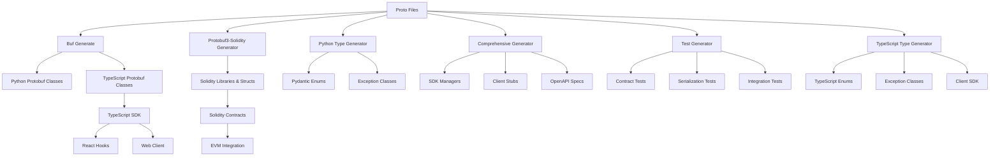
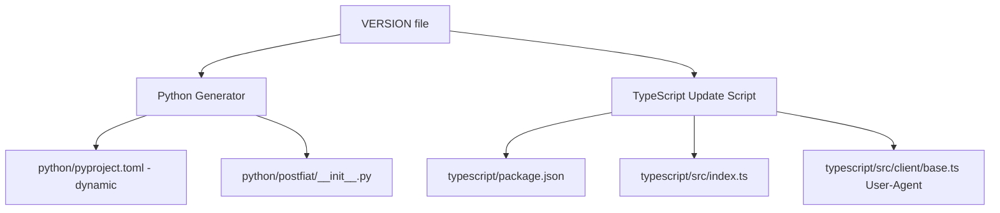

# PostFiat SDK Development Guide

This document describes the code generation architecture and development processes for the PostFiat SDK.

## 🎯 Architecture Overview

The PostFiat SDK follows a **proto-first architecture** where Protocol Buffer definitions are the single source of truth for all generated code across multiple languages and platforms.

### Multi-Language Support

The SDK now supports multiple programming languages with a shared proto definition:

```
postfiat-sdk/
├── proto/                    # Shared protocol buffer definitions
│   ├── buf.gen.yaml         # Multi-language generation config
│   └── postfiat/v3/         # Proto schema definitions
├── python/                   # Python SDK
│   ├── postfiat/            # Python package
│   ├── scripts/             # Python-specific generators
│   └── tests/               # Python test suites
├── typescript/              # TypeScript SDK
│   ├── src/                 # TypeScript source code
│   ├── scripts/             # TypeScript generation scripts
│   └── tests/               # TypeScript test suites
├── solidity/                # Solidity SDK
│   ├── src/                 # Solidity source code
│   ├── src/generated/       # Generated Solidity contracts
│   ├── test/                # Solidity test suites
│   └── foundry.toml         # Foundry configuration
└── docs/                    # Shared documentation
```



## 🔧 Code Generation Pipeline

### 1. Protocol Buffer Generation

**Tool:** [Buf CLI](https://buf.build/)
**Config:** `proto/buf.gen.yaml`

**Command:** `make proto` (recommended) or direct command

<!-- AUTO-GENERATED SECTION: protocol-buffer-generation -->

**Generates:**
- `python/postfiat/v3/messages_pb2.py` - Python message classes
- `python/postfiat/v3/errors_pb2.py` - Python error classes
- `python/postfiat/v3/errors_pb2_grpc.py` - Python gRPC error stubs
- `python/postfiat/v3/messages_pb2_grpc.py` - Python gRPC service stubs
- `typescript/src/generated/postfiat/v3/errors_pb.ts` - TypeScript error classes
- `typescript/src/generated/postfiat/v3/messages_pb.ts` - TypeScript message classes
- `typescript/src/generated/a2a/v1/a2a_pb.ts` - Generated file
- `typescript/src/generated/postfiat/v3/messages_connect.ts` - TypeScript gRPC-Web service stubs
- `typescript/src/generated/a2a/v1/a2a_connect.ts` - Generated file
- `solidity/src/generated/postfiat/v3/` - Solidity contracts and libraries
- `api/openapi_v2_generated.swagger.json` - OpenAPI specification

<!-- END AUTO-GENERATED SECTION -->

**Example:**
```bash
# Recommended: Use Makefile (handles dependencies and post-processing)
make proto

# Direct command (requires manual dependency setup)
cd proto && ../bin/buf generate --template buf.gen.yaml
```

### 2. Python Type Generation

**Script:** `python/scripts/generate_python_types.py`
**Purpose:** Generate Pydantic-compatible types from protobuf enums

**Intended Generates:**
- `python/postfiat/types/enums.py` - Pydantic enum classes  
- `python/postfiat/exceptions.py` - SDK exception hierarchy

**Features:**
- Automatic enum extraction from protobuf (when imports work)
- Pydantic compatibility with conversion methods
- Standard exception hierarchy for SDK errors

**Example:**
```python
# Generated enum usage
from postfiat.types.enums import MessageType, EncryptionMode
```

<!-- AUTO-GENERATED SECTION: development-python-example -->
```python
# Available values: MessageType.CORE_MESSAGE, MessageType.MULTIPART_MESSAGE_PART

# Available values: EncryptionMode.NONE, EncryptionMode.PROTECTED, EncryptionMode.PUBLIC_KEY
```
<!-- END AUTO-GENERATED SECTION -->

**Example usage:**
```python
msg_type = MessageType.CORE_MESSAGE
encryption = EncryptionMode.PROTECTED
```

**Convert to/from protobuf:**
```python
pb_value = msg_type.to_protobuf()
pydantic_value = MessageType.from_protobuf(pb_value)
```

### 3. Solidity Contract Generation

**Tool:** [Protobuf3-Solidity](https://github.com/allenday/protobuf3-solidity)
**Purpose:** Generate Solidity contracts and libraries from protobuf definitions

**Dependencies:**
- `@lazyledger/protobuf3-solidity-lib` ^0.6.0
- `@openzeppelin/contracts` ^5.0.0
- `Foundry` - Build toolkit (see foundry.toml)

**Generates:**
- `solidity/src/generated/a2a/v1/` - A2A protobuf contracts
- `solidity/src/generated/google/protobuf/` - Google protobuf types
- `solidity/src/generated/postfiat/v3/` - PostFiat protobuf contracts

**Features:**
- Automatic struct and enum generation from protobuf
- Type-safe contract interfaces
- Library-based organization for reusability
- Foundry integration for modern Solidity development
- Seamless integration with Python and TypeScript SDKs

**Example:**
```solidity
// Generated struct example (manually curated for docs)
library Postfiat_V3 {
    struct Envelope {
        uint32 version;
        bytes content_hash;
        MessageType message_type;
        EncryptionMode encryption;
        string reply_to;
        ContextReference[] public_references;
        AccessGrant[] access_grants;
        bytes message;
        MetadataEntry[] metadata;
    }
}
```

<!-- AUTO-GENERATED SECTION: development-solidity-example -->
```solidity
enum MessageType {
    CORE_MESSAGE,
    MULTIPART_MESSAGE_PART
}

enum EncryptionMode {
    NONE,
    PROTECTED,
    PUBLIC_KEY
}
```
<!-- END AUTO-GENERATED SECTION -->

**Build System:**
```bash
# Generate Solidity contracts from protobuf
make proto

# Build contracts with Foundry
make sol-build

# Run Solidity tests
make sol-test
```

### 4. TypeScript Type Generation

**Script:** `typescript/scripts/generate-typescript-types.ts`
**Purpose:** Generate TypeScript types and SDK components from protobuf definitions

**Generates:**
- `typescript/src/index.ts` - Main SDK export file
- `typescript/src/types/exceptions.ts` - SDK exception hierarchy
- `typescript/src/types/enums.ts` - TypeScript enum classes with conversion utilities
- `typescript/src/client/base.ts` - Base client infrastructure
- `typescript/src/hooks/index.tsx` - React hooks for web integration

**Features:**
- Automatic enum extraction from protobuf
- gRPC-Web client support via Connect-ES
- React hooks for modern web development
- Type-safe error handling
- Conversion utilities between proto and TypeScript types

**Example:**
```typescript
// Generated enum usage
import { MessageType, EncryptionMode } from '@postfiat/sdk';
```

<!-- AUTO-GENERATED SECTION: development-typescript-example -->
```typescript
// Available values: MessageType.CORE_MESSAGE, MessageType.MULTIPART_MESSAGE_PART

// Available values: EncryptionMode.NONE, EncryptionMode.PROTECTED, EncryptionMode.PUBLIC_KEY
```
<!-- END AUTO-GENERATED SECTION -->

**Example usage:**
```typescript
const msgType = MessageType.CORE_MESSAGE;
const encryption = EncryptionMode.PROTECTED;
```

**Convert to/from protobuf:**
```typescript
const pbValue = MessageType.toProtobuf(msgType);
const tsValue = MessageType.fromProtobuf(pbValue);
```

### 5. Comprehensive SDK Generation

**Script:** `python/scripts/generate_protobuf.py`
**Purpose:** Generate complete SDK components from protobuf definitions

**Generates:**
- `python/postfiat/models/envelope_enums.py` - Message envelope enums
- `python/postfiat/models/common_enums.py` - Common Pydantic-compatible enums
- `python/postfiat/services/impl/envelope_storage_impl.py` - Service implementation stubs
- `python/postfiat/services/impl/content_storage_impl.py` - Service implementation stubs
- `python/postfiat/services/impl/agent_registry_impl.py` - Service implementation stubs
- `api/openapi_v2_generated.swagger.json` - OpenAPI/Swagger specifications

**Features:**
- Automatic service discovery from protobuf
- Manager pattern for service orchestration
- Client stubs for easy API consumption
- OpenAPI generation for REST endpoints
- Discord integration for command handling

### 6. Documentation Generation

**Script:** `scripts/generate_docs.py`
**Purpose:** Generate comprehensive documentation with automated content synchronization

**Generates:**
- `docs/generated/proto/index.md` - Complete protobuf API reference (via protoc-gen-doc)
- `docs/api/openapi.md` - OpenAPI wrapper file with Swagger UI integration
- Dynamic content in `docs/SERVICES.md` - Service matrices - Auto-generated gRPC service tables
- Dynamic content in `docs/ARCHITECTURE.md` - Enum snippets - Synchronized examples
- Dynamic content in `docs/DEVELOPMENT.md` - Enum snippets - Synchronized examples

**Features:**
- **Auto-generated sections:** Uses `<!-- AUTO-GENERATED SECTION: xyz -->` markers
- **Enum synchronization:** Extracts enums from proto files to prevent documentation drift
- **Multi-format support:** Generates protobuf, Solidity, Python, and TypeScript examples
- **Service matrix generation:** Creates comprehensive gRPC service documentation
- **OpenAPI integration:** Cross-references REST endpoints with service methods

**Commands:**
```bash
# Generate all documentation (includes TypeScript docs via TypeDoc)
make docs

# Generate only protobuf docs, service matrices, and enum snippets
python scripts/generate_docs.py
```

### 7. TypeScript Test Generation

**Script:** `typescript/scripts/generate-typescript-tests.ts`
**Purpose:** Generate comprehensive TypeScript test suites from protobuf definitions

**Generates:**
- `typescript/tests/generated/enums.test.ts` - Enum conversion and validation tests
- `typescript/tests/generated/client.test.ts` - Client SDK tests
- `typescript/tests/generated/integration.test.ts` - Integration test suite
- `typescript/tests/generated/exceptions.test.ts` - Exception handling tests
- `typescript/tests/generated/hooks.test.tsx` - React hooks tests

**Features:**
- Jest-based testing framework
- Comprehensive enum testing (conversion, validation, edge cases)
- Exception hierarchy testing
- Client SDK integration testing
- React hooks testing with modern patterns

### 8. Solidity Test Generation

**Tool:** Foundry (forge)
**Purpose:** Test generated Solidity contracts and custom contract implementations

**Test Structure:**
- `solidity/test/` - Manual test files
- `solidity/src/generated/` - Generated contract files (tested via integration)

**Features:**
- Foundry-based testing framework
- Gas optimization testing
- Contract integration testing
- Protobuf serialization/deserialization testing
- Cross-language compatibility testing

**Example:**

<!-- AUTO-GENERATED SECTION: development-solidity-test-example -->
```solidity
enum MessageType {
    CORE_MESSAGE,
    MULTIPART_MESSAGE_PART
}

enum EncryptionMode {
    NONE,
    PROTECTED,
    PUBLIC_KEY
}
```
<!-- END AUTO-GENERATED SECTION -->

```solidity
// Test generated protobuf contracts
contract PostfiatV3Test is Test {
    function testEnvelope() public {
        Postfiat_V3.Envelope memory envelope = Postfiat_V3.Envelope({
            version: 1,
            content_hash: "0x1234",
            message_type: Postfiat_V3.MessageType.CORE_MESSAGE,
            encryption: Postfiat_V3.EncryptionMode.PROTECTED,
            reply_to: "",
            public_references: new Postfiat_V3.ContextReference[](0),
            access_grants: new Postfiat_V3.AccessGrant[](0),
            message: "Hello, World!",
            metadata: new MetadataEntry[](0)
        });
        
        assertEq(envelope.version, 1);
        assertEq(uint8(envelope.message_type), uint8(Postfiat_V3.MessageType.CORE_MESSAGE));
        assertEq(uint8(envelope.encryption), uint8(Postfiat_V3.EncryptionMode.PROTECTED));
    }
}
```

**Testing Commands:**
```bash
# Run all Solidity tests
make sol-test

# Run specific test file
cd solidity && forge test --match-contract PostfiatV3Test

# Run with gas reporting
cd solidity && forge test --gas-report
```

### 9. Test Generation

**🆕 Dynamic Test Generator (Recommended):**
**Script:** `python/scripts/generate_dynamic_protobuf_tests.py`
**Purpose:** Generate comprehensive test suites using runtime proto introspection

**Generates:**
- `python/tests/generated/test_dynamic_serialization.py` - Round-trip serialization tests
- `python/tests/generated/test_dynamic_validation.py` - Field and enum validation tests
- `python/tests/generated/test_dynamic_services.py` - gRPC service method tests
- `python/tests/generated/test_dynamic_evolution.py` - Schema evolution and compatibility tests

**Key Features:**
- **Runtime Introspection:** Uses actual proto message descriptors (no hardcoded field names)
- **Auto-Adaptation:** Tests automatically adapt when proto schemas change
- **Schema Evolution:** Tests backward compatibility and wire format stability
- **Comprehensive Coverage:** Generates tests for all discovered proto messages

**Test Types:**
- **Serialization Integrity:** Validates round-trip serialization
- **Field Type Validation:** Tests field constraints and types
- **Enum Validation:** Verifies enum values and conversions
- **Service Integration:** Tests service method signatures
- **Schema Evolution:** Tests backward compatibility and field number stability

## 🔧 Recent Improvements

### Enhanced Documentation Generation

**New Features Added:**
- **protoc-gen-doc integration:** Automatic installation via `make deps` for comprehensive proto documentation
- **Enum synchronization system:** Prevents documentation drift by auto-generating enum examples
- **Service matrix generation:** Auto-generated gRPC service tables in SERVICES.md
- **Multi-format enum examples:** Supports protobuf, Solidity, Python, and TypeScript contexts

**Dependencies Resolved:**
- Added Go-based `protoc-gen-doc` installation to local development workflow
- Enhanced error messaging when Go is not available
- Synchronized local and CI dependency management

## 📦 Version Management

### Centralized Version System

The PostFiat SDK uses a **centralized version management** system to ensure consistency across all packages and artifacts.

**Central Source of Truth:**
```
VERSION                           # Single source of truth for all version numbers
```

**Version Flow:**


### Updating Versions

**Automated Update (Recommended):**
```bash
# Update VERSION file
echo "0.4.0" > VERSION

# Update all packages automatically
./scripts/update-all-versions.sh
```

**Manual Component Updates:**
```bash
# Python packages only
cd python && python scripts/generate_python_types.py

# TypeScript packages only  
cd typescript && npm run update-version
```

**Generated Files:**
- `python/pyproject.toml`: Uses dynamic versioning via `setup.py`
- `python/postfiat/__init__.py`: `__version__ = "0.4.0"`
- `typescript/package.json`: `"version": "0.4.0"`
- `typescript/src/index.ts`: `export const VERSION = '0.4.0'`
- `typescript/src/client/base.ts`: User-Agent header with version

**Version Validation:**
```bash
# Check current centralized version
cat VERSION

# Check Python version (if generated)
cd python && python -c "import postfiat; print(postfiat.__version__)" 2>/dev/null || echo "Not yet generated"

# Check TypeScript version  
cd typescript && node -e "console.log(require('./package.json').version)"

# Verify all versions match
./scripts/update-all-versions.sh | grep "Version:"
```

### Release Process

1. **Update VERSION file:** `echo "0.4.0" > VERSION`
2. **Update all packages:** `./scripts/update-all-versions.sh`
3. **Test changes:** Run test suites across all packages
4. **Commit changes:** `git add . && git commit -m "feat: bump to 0.4.1"`
5. **Create release tag:** `git tag release-0.4.1 && git push --tags`
6. **CI builds artifacts:** GitHub Actions automatically creates release artifacts

## 🔄 Development Workflow

### Local Development

**Edit Proto Files:**
```bash
# Edit proto/postfiat/v3/*.proto
vim proto/postfiat/v3/messages.proto
```

**Initial Setup:**
```bash
# Install all dependencies (required for first-time setup)
make deps

# Setup A2A dependency (if not done automatically)
./scripts/setup-a2a-dependency.sh
```

**Generate Code:**
```bash
# Generate protobuf classes (recommended: use Makefile)
make proto

# Or direct command (requires manual dependency setup)
cd proto && buf generate --template buf.gen.yaml && cd ..

# Generate Python types and tests
cd python && python scripts/generate_python_types.py
python scripts/generate_protobuf.py
python scripts/generate_dynamic_protobuf_tests.py && cd ..

# Generate TypeScript SDK
cd typescript && npm run generate:all && cd ..

# Or regenerate everything at once
make regen-all
```

**Test Changes:**
```bash
# Run Python tests
cd python && pytest tests/manual/ -v && cd ..      # Manual tests only
cd python && pytest tests/ -v && cd ..             # All tests (manual + generated)

# Run TypeScript tests
cd typescript && npm test && cd ..

# Run Solidity tests
make sol-test

# Test specific components
python -c "from postfiat.v3 import messages_pb2; print('✅ Protobuf import works')"
python -c "from postfiat.types.enums import MessageType; print('✅ Enums work')"

# Run all tests across all languages
make tests
```

**Version Management:**
```bash
# Update all package versions from VERSION file
make bump-version
```

### CI/CD Pipeline

The CI automatically handles validation, generation, testing, and building across multiple parallel jobs:

**Main CI Workflow (`ci.yml`):**

**Triggers:** Push to main/dev branches, Pull requests to main/dev branches

**Sequential Foundation:**
- **`proto-validation`: Proto Validation** - Proto linting and breaking change detection (PR-only)
- **`code-generation`: Code Generation** - Generate all protobuf classes and run comprehensive tests

**Parallel Testing (Matrix Jobs):**
- **`python-tests`: Python & TypeScript Tests** - Test across Python 3.10, 3.11, 3.12
- **`solidity-tests`: Solidity Tests** - Foundry-based contract testing with gas reporting
- **`typescript-tests`: TypeScript Tests** - Test across Node.js 20, 22

**Dependent Build Jobs:**
- **`build`: Build Python Package** - Requires proto-validation + python-tests + solidity-tests
- **`typescript-build`: Build TypeScript Package** - Requires proto-validation + typescript-tests
- **`solidity-build`: Build Solidity Package** - Requires proto-validation + solidity-tests

**Key Features:**
- **Auto-commit permissions:** Writes generated files back to repository
- **Breaking change detection:** Only runs on pull requests
- **Artifact uploads:** All build jobs upload distribution packages
- **Matrix testing:** Ensures compatibility across multiple runtime versions

**Key CI Steps (Makefile-driven):**

```bash
# Each job runs these core steps:
make help           # Default target
make bump-version           # Version bumping
make regen-all           # Regenerate all code (proto + types + tests)
make tests           # All tests across all languages
make release           # Build all release artifacts (Python + TypeScript + Solidity)
```

**Release Workflows:**

**`release.yml` (triggers on push tags: v*):**
1. Complete code generation and version synchronization
2. Build all release artifacts (Python, TypeScript, Solidity)
3. Create GitHub release with comprehensive release notes
4. Attach all build artifacts (`.whl`, `.tar.gz`, `.tgz`, contract archives)
5. No automatic publishing to npm/PyPI (manual control for security)

**`release-artifacts.yml` (triggers on push tags: release-*, v[0-9]+.[0-9]+.[0-9]+-*):**
- Alternative release pipeline for artifact-only releases
- Supports version tag patterns for flexible releasing

**Documentation Deployment (`docs.yml`):**
- Builds and deploys documentation to GitHub Pages
- Triggers: triggers on push to: main, triggers on PRs to: main, manual dispatch
- Uses `make docs` for comprehensive doc generation

## 📁 Generated File Management

### .gitignore Strategy

**Status:** All essential patterns are properly configured.

**Ignored (Generated) Files:**

| File/Directory | Type | Status |
|---|---|---|
| `postfiat_pfsdk.egg-info/` | Directory | Directory containing generated files |
| `api/` | Directory | Directory containing generated files |
| `site/` | Directory | Directory containing generated files |
| `proto/a2a` | File | Directory containing generated files |
| `third_party/googleapis/` | Directory | Directory containing generated files |
| `bin/` | Directory | Directory containing generated files |
| `docs/generated/` | Directory | Directory containing generated files |
| `python/a2a/v1/a2a_pb2.py` | File | Auto-generated file |
| `python/a2a/v1/a2a_pb2_grpc.py` | File | Auto-generated file |
| `python/postfiat/v3/messages_pb2.py` | File | Auto-generated file |
| `python/postfiat/v3/errors_pb2.py` | File | Auto-generated file |
| `python/postfiat/v3/errors_pb2_grpc.py` | File | Auto-generated file |
| `python/postfiat/v3/messages_pb2_grpc.py` | File | Auto-generated file |
| `typescript/src/generated/` | Directory | Directory containing generated files |
| `typescript/src/types/enums.ts` | File | Auto-generated file |
| `typescript/src/types/exceptions.ts` | File | Auto-generated file |
| `typescript/src/client/base.ts` | File | Auto-generated file |
| `typescript/src/index.ts` | File | Auto-generated file |
| `typescript/tests/generated/` | Directory | Directory containing generated files |
| `solidity/src/generated/` | Directory | Directory containing generated files |

**Committed (Source) Files:**

| File/Directory | Type | Description |
|---|---|---|
| `proto/` | Directory | Protocol buffer definitions |
| `proto/buf.gen.yaml` | File | Generation configuration |
| `proto/buf.gen.docs.yaml` | File | Documentation generation config |
| `proto/buf.gen.openapi-only.yaml` | File | OpenAPI generation config |
| `proto/buf.yaml` | File | Buf workspace configuration |
| `proto/buf.lock` | File | Buf dependency lock file |
| `VERSION` | File | Centralized version file |
| `python/pyproject.toml` | File | Python package configuration |
| `typescript/package.json` | File | TypeScript package configuration |
| `typescript/tsconfig.json` | File | TypeScript compiler configuration |
| `solidity/package.json` | File | Solidity dependencies |
| `solidity/foundry.toml` | File | Foundry build configuration |
| `mkdocs.yml` | File | Documentation site configuration |
| `Makefile` | File | Build orchestration |
| `scripts/` | Directory | All generation and build scripts |
| `python/scripts/` | Directory | Python-specific generators |
| `typescript/scripts/` | Directory | TypeScript-specific generators |
| `solidity/script/` | Directory | Solidity deployment scripts |
| `.github/workflows/` | Directory | GitHub Actions workflow definitions |
| `.gitignore` | File | Version control ignore patterns |
| `third_party/a2a/` | Directory | A2A protocol submodule |
| `third_party/forge-std/` | Directory | Foundry standard library submodule |
| `third_party/googleapis/` | Directory | Google APIs submodule |
| `README.md` | File | Main project documentation |
| `python/README.md` | File | Python SDK documentation |
| `typescript/README.md` | File | TypeScript SDK documentation |
| `python/MANIFEST.in` | Directory | Python package manifest |
| `docs/` | Directory | Core documentation files (non-generated) |
| `overrides/` | Directory | MkDocs theme customizations |
| `python/postfiat/__init__.py` | File | Python package root |
| `python/postfiat/envelope/` | Directory | Envelope utilities (manual) |
| `typescript/src/hooks/` | Directory | React hooks (non-generated) |
| `solidity/src/contracts/` | Directory | Manual Solidity contracts |
| `python/tests/manual/` | Directory | Manual Python test suites |
| `typescript/tests/manual/` | Directory | Manual TypeScript test suites |
| `typescript/tests/setup.js` | File | TypeScript test setup |
| `solidity/test/` | Directory | Manual Solidity test files |
| `python/examples/` | Directory | Python usage examples |
| `typescript/examples/` | Directory | TypeScript usage examples |

### Branch-Specific Behavior

**Dev Branch:**
- Generated files ignored via .gitignore
- Clean source-only development
- Developers run generation locally

**Release Strategy:**
- Use git tags with "release-" prefix (e.g., release-0.1.0-rc1)
- CI automatically builds and attaches Python/TypeScript packages
- No automatic publishing to npm/PyPI registries
- GitHub releases contain downloadable artifacts

## 🧪 Testing Architecture

### Test Organization

```
python/tests/
├── manual/                    # Manual tests (committed)
│   ├── unit/                 # Unit tests
│   │   ├── conftest.py
│   │   ├── test_agent_registry_service.py
│   │   ├── test_content_storage_service.py
│   │   └── test_envelope_storage_service.py
│   ├── test_content_storage.py
│   └── test_envelope_store.py
└── generated/                 # Auto-generated tests (aspirational)
    ├── test_dynamic_serialization.py    # 🆕 Dynamic serialization tests
    ├── test_dynamic_validation.py       # 🆕 Dynamic field/enum validation  
    ├── test_dynamic_services.py         # 🆕 Dynamic service tests
    └── test_dynamic_evolution.py        # 🆕 Schema evolution tests

typescript/tests/
├── manual/                    # Manual tests (committed)
│   ├── integration/          # Integration tests
│   │   └── selective-disclosure.test.ts  # 🎯 Enhanced 3,048 scenario test
│   └── unit/                 # Unit tests
│       ├── content-storage.test.ts
│       ├── envelope-store.test.ts
│       ├── PostFiatCrypto.test.ts
│       └── services.test.ts
├── setup.js                  # Test setup (committed)
└── generated/                # Auto-generated tests (committed)
    ├── enums.test.ts         # Enum conversion and validation tests
    ├── exceptions.test.ts    # Exception handling tests
    ├── client.test.ts        # Client SDK tests
    ├── hooks.test.tsx        # React hooks tests
    └── integration.test.ts   # Integration test suite
```

### Test Types

**Manual Tests:**
- Business logic validation
- Integration testing
- Edge case handling
- User workflow testing
- **Selective disclosure testing** (TypeScript: 3,048 scenarios)

**Generated Tests (Dynamic):**
- Runtime proto introspection-based testing
- Serialization round-trip testing with actual field discovery
- Field constraint validation using proto descriptors
- Enum value verification from runtime schema
- Service method signature testing
- Schema evolution and backward compatibility testing

### 🎯 Selective Disclosure Test Enhancement

The TypeScript SDK includes a comprehensive selective disclosure integration test that validates 3,048 unique scenarios across multiple dimensions:

**Test Location:** `typescript/tests/manual/integration/selective-disclosure.test.ts`

**Test Dimensions:**
1. **Base Scenarios (432):** Original permutation test from SDK v0.1.0-rc15
   - Sender sequences: AAA, AAB, ABA, ABB, BAA, BAB, BBA, BBB
   - Encryption modes: NONE, PROTECTED, PUBLIC_KEY
   - Initial recipients: broadcast, direct
   - Public/private reference counts: 0, 1, 2

2. **AccessGrant Complexity (+864 scenarios):**
   - Single content key grant
   - Single group key grant
   - Multiple content key grants
   - Multiple group key grants
   - Mixed content + group key grants

3. **Context DAG Depth (+432 scenarios):**
   - Deep context chains (0-5 levels)
   - Circular reference detection
   - Branching DAG structures
   - Partial access scenarios

4. **Multi-Group Access Patterns (+672 scenarios):**
   - Single group membership
   - Multiple same-level groups
   - Multiple different access levels
   - Hierarchical group relationships
   - Overlapping group memberships
   - Exclusive group access patterns

**Key Features:**
- **PostFiat Opinionated Crypto:** Uses one-line encryption/decryption APIs
- **100% Pass Rate:** All 6,096 test executions pass (3,048 scenarios × 2 observers)
- **Fast Execution:** ~2 seconds for full test suite
- **v3 Protocol Compliance:** Uses AccessGrant system and proper ContextReference handling

**Running the Test:**
```bash
cd typescript
npm run test:selective-disclosure
```

## 🔧 Extending the SDK

### Adding New Proto Files

1. **Create proto file:**
   ```protobuf
   // proto/postfiat/v3/new_service.proto
   syntax = "proto3";
   package postfiat.v3;
   
   import "google/api/annotations.proto";
   
   service NewService {
     rpc DoSomething(DoSomethingRequest) returns (DoSomethingResponse) {
       option (google.api.http) = {
         post: "/v3/new-service/do-something"
         body: "*"
       };
     };
   }
   
   message DoSomethingRequest {
     string input = 1;
   }
   
   message DoSomethingResponse {
     string result = 1;
   }
   ```

2. **Regenerate code:**

```bash
make proto
```

3. **Generated automatically:**
   - Protocol buffer message classes (`*_pb2.py`, `*_pb.ts`, `*.sol`)
   - gRPC client stubs (`*_pb2_grpc.py`, `*_connect.ts`) 
   - OpenAPI specification (updated `api/openapi_v2_generated.swagger.json`)
   - Solidity contract bindings (`*.sol` in `solidity/src/generated/`)

4. **Manual steps required:**
   - Service implementation classes
   - Integration tests
   - Business logic

### Available Generator Scripts

**Current generator scripts:**
- `python/scripts/ci_test_generation.py` - CI test automation and generation
- `python/scripts/dev_test_regen.py` - Development test regeneration utilities
- `python/scripts/generate_dynamic_protobuf_tests.py` - Dynamic proto introspection tests
- `python/scripts/generate_fastapi_services.py` - FastAPI service implementations
- `python/scripts/generate_protobuf.py` - Comprehensive protobuf code generation
- `python/scripts/generate_python_types.py` - Python type classes and enums
- `python/scripts/generate_service_tests.py` - Service test scaffolding
- `python/scripts/proto_introspection.py` - Protocol buffer introspection utilities
- `python/scripts/schema_evolution_test_generator.py` - Schema evolution and compatibility tests
- `python/scripts/serialization_test_generator.py` - Serialization round-trip test generation
- `python/scripts/service_test_generator.py` - Service method test generation
- `python/scripts/validation_test_generator.py` - Field validation test generation
- `typescript/scripts/generate-typescript-tests.ts` - TypeScript test generation
- `typescript/scripts/generate-typescript-types.ts` - TypeScript enums and exceptions
- `typescript/scripts/update-version.js` - Version synchronization utility

### Adding Custom Generators

1. **Create generator script:**
   ```python
   # python/scripts/generate_custom_component.py
   def generate_custom_component():
       # Your generation logic
       pass
   
   if __name__ == "__main__":
       generate_custom_component()
   ```

2. **Add to Makefile:**
   ```makefile
   custom-gen:
   	cd python && python scripts/generate_custom_component.py
   	@echo "✅ Custom component generation complete"
   ```

3. **Add to CI pipeline:**
   ```yaml
   - name: Generate custom component
     run: make custom-gen
   ```

4. **Integration with main build:**
   ```makefile
   # Add to regen-all target (current: regen-all: proto types tests)
   regen-all: proto types tests custom-gen
   ```

## 📊 Monitoring and Debugging

### Prerequisites

Before running any generation scripts, ensure dependencies are installed:

```bash
# Install SDK dependencies (required for all scripts)
pip install -e .

# Generate protobuf files (required for type generation)
make proto
```

### Structured Logging

**Dependencies:**
- **structlog:** Structured logging with rich context
- **loguru:** Beautiful console output and formatting

**Usage in Development:**
```python
from postfiat.logging import get_logger

logger = get_logger("my_component")
logger.info("Processing request", user_id="123", action="create_wallet")
```

**Environment-Aware Output Formats:**
- **Development/Testing:** Human-readable console with colors and timestamps
  ```
  2025-07-28 19:15:23.456 | INFO     | my_component:process:45 - Processing request | user_id=123 action=create_wallet
  ```
- **Production:** JSON structured logs for machine parsing
  ```json
  {"timestamp": "2025-07-28T19:15:23.456Z", "level": "info", "logger": "my_component", "event": "Processing request", "user_id": "123", "action": "create_wallet"}
  ```
- **pytest:** Plain text for test readability

### Generation Script Logs

All generation scripts provide detailed structured logging with human-readable console output:

```bash
python scripts/generate_python_types.py
# 🔄 Generating Python types from protobuf definitions...
# 2025-07-28 19:15:23.456 | INFO     | generate_python_types:main:45 - Starting type generation
# 2025-07-28 19:15:23.567 | INFO     | generate_python_types:scan:78 - Discovered protobuf definitions | enum_types_count=5 modules=['messages', 'errors']
# ✅ Generated /path/to/postfiat/types/enums.py
# ✅ Generated /path/to/postfiat/exceptions.py

python scripts/generate_dynamic_protobuf_tests.py
# 🎯 Dynamic Proto Test Generation with Runtime Introspection
# 2025-07-28 19:16:15.123 | INFO     | proto.dynamic_test_generator:discover:120 - Discovered proto message classes | count=10
# 2025-07-28 19:16:15.234 | INFO     | proto.dynamic_test_generator:generate:155 - Generated serialization tests | output_file=tests/generated/test_dynamic_serialization.py
# 2025-07-28 19:16:15.345 | INFO     | proto.dynamic_test_generator:generate:197 - Generated evolution tests | output_file=tests/generated/test_dynamic_evolution.py
# ✅ SUCCESS: Dynamic proto test generation complete!

python scripts/generate_protobuf.py
# 🚀 Generating comprehensive SDK from protobuf definitions...
# 2025-07-28 19:17:00.123 | INFO     | generate_protobuf:scan:45 - Found message types and services | messages=3 services=0
# 2025-07-28 19:17:00.234 | INFO     | generate_protobuf:generate:89 - Generated envelope enums | message_types=3
# ✅ Generation complete!
```

### CI Debugging

Check GitHub Actions for detailed logs:
1. Go to Actions tab
2. Click on failed workflow
3. Expand job steps to see generation output
4. Look for specific error messages

### Common Issues

**Import Errors:**
- **Prerequisites:** Ensure dependencies installed (`pip install -e .`) and proto files generated (`make proto`)
- Check namespace consistency: `postfiat.v3` vs `postfiat.wallet.v3`
- Verify all required protobuf modules are available

**Generation Failures:**
- **Prerequisites:** Install dependencies (`pip install -e .`) before running generators
- Verify proto syntax: `buf lint`
- Check buf configuration: `buf.yaml` and `buf.gen.yaml`
- Ensure all imports and dependencies available

**Test Failures:**
- **Prerequisites:** Ensure dependencies installed (`pip install -e .`) and proto files generated (`make proto`)
- Regenerate dynamic tests: `cd python && python scripts/generate_dynamic_protobuf_tests.py`
- Use CI integration: `cd python && python scripts/ci_test_generation.py --force`
- Check protobuf message compatibility
- Verify enum values match proto definitions

## � Logging Best Practices

### When to Add Logging

**✅ DO Log:**
- **Factory functions:** Exception creation, object construction
- **Utility methods:** Data processing, transformations
- **API middleware:** Request/response processing
- **Service boundaries:** External API calls, database operations
- **Error handling:** Exception processing and recovery

**❌ DON'T Log:**
- **Pure data classes:** Pydantic models, simple exception classes
- **Getters/setters:** Simple property access
- **Constructors:** Basic object initialization without side effects
- **Pure functions:** Mathematical operations, simple transformations

### Logging Patterns

**Structured Context:**
```python
logger.info(
    "Processing user request",
    user_id=user.id,
    action="create_wallet",
    request_id=request_id,
    duration_ms=elapsed_time
)
```

**Error Logging:**
```python
logger.error(
    "Database operation failed",
    operation="insert_wallet",
    table="wallets",
    error_code=exc.error_code,
    retry_count=retry_count,
    exc_info=True  # Include stack trace
)
```

**Warning Level Logging:**
```python
logger.warning(
    "Envelope not found",
    envelope_id=request.envelope_id,
    operation="retrieve"
)
```

**Debug Information:**
```python
logger.debug(
    "Found envelopes in store",
    store_name=store_name,
    count=len(store_results),
    content_hash=content_hash.hex()[:16] + "..."
)
```

### Generated Code Logging

The code generators automatically add logging to:

- **Exception factory functions:** `create_exception_from_error_code()`
- **Error processing utilities:** `create_exception_from_error_info()`
- **Serialization methods:** `PostFiatError.to_dict()`
- **Test generation:** Discovery and generation progress

**Generated Exception Factory Example:**
```python
# Auto-generated in postfiat/exceptions.py
def create_exception_from_error_code(error_code, message, **kwargs):
    logger = get_logger("exceptions.factory")
    logger.info(
        "Creating exception from error code",
        error_code=error_code.name,
        error_value=error_code.value,
        message=message
    )
```

**Generated Serialization Example:**
```python
# Auto-generated in PostFiatError.to_dict()
def to_dict(self):
    logger = get_logger("exceptions.serialization")
    logger.debug(
        "Serialized exception to dictionary",
        exception_type=self.__class__.__name__,
        error_code=result['error_code'],
        has_details=bool(self.details)
    )
```

Pure data classes (enums, simple exceptions) remain clean without logging.

## 🚀 Performance Considerations

### Generation Speed

- **Incremental generation:** Only regenerate changed components
- **Parallel processing:** Use multiple cores where possible
- **Caching:** Cache generated artifacts between runs

### Runtime Performance

- **Lazy imports:** Import generated modules only when needed
- **Connection pooling:** Reuse gRPC connections
- **Serialization optimization:** Use efficient protobuf serialization

## 📋 Best Practices

- **Proto-first development:** Always start with proto definitions
- **Consistent naming:** Follow protobuf naming conventions
- **Backward compatibility:** Use field numbers carefully
- **Documentation:** Document proto files thoroughly
- **Testing:** Test both manual and generated components
- **Version management:** Use semantic versioning for releases

This architecture ensures maintainable, scalable, and robust SDK development with minimal manual overhead. 🎯

## 🛠️ Build & Test Workflow (Unified)

The Makefile at the project root now orchestrates all major development tasks for both Python and TypeScript SDKs. Use these targets for a consistent workflow:

### Setup
```bash
make dev-setup  # Installs all dependencies and generates code
```

### Code Generation
```bash
make proto          # Generate protobuf classes
make types          # Generate Python types
make tests-dynamic  # Generate dynamic proto tests (Python)
make regen-all      # Regenerate everything (proto + types + tests-dynamic)
```

### Testing
```bash
make tests-dynamic  # Generate dynamic proto tests (Python)
make tests-manual   # Run manual Python tests
make tests-core     # Run core dynamic Python tests
make tests-all      # Run all generated and manual Python tests
make ts-build       # Build TypeScript SDK
make ts-test        # Run TypeScript tests
make ts-test-all    # Run all TypeScript unit and integration tests
make tests          # Run all tests (Python + TypeScript + Solidity) - RECOMMENDED
make test           # Alias for 'tests'
```

- The `tests` target runs Python, TypeScript, and Solidity tests for full coverage.
- `test` is simply an alias for `tests`.
- All TypeScript build/test commands are available via Makefile.

### 🧪 TypeScript Test Generation

To generate and run TypeScript tests:
```bash
make ts-test-all
```

### 🧪 Running All Tests

To run all tests (Python + TypeScript + Solidity):
```bash
make tests
```

## 🚦 CI/CD Flows & Makefile-Driven Development

The PostFiat SDK uses a Makefile-driven workflow for all build, test, code generation, versioning, and documentation tasks. This ensures that what you run locally is exactly what CI runs, making it easy to anticipate and debug CI failures.

### CI/CD Flows

**Verification (PRs, pushes to dev/main):**
- Proto validation and linting
- Code generation across all languages
- Matrix testing:
  - **Python:** 3.10, 3.11, 3.12
  - **TypeScript:** Node.js 20, 22
  - **Solidity:** Foundry with gas reporting
- Build verification for all packages
- **CI:** Calls `make bump-version`, `make regen-all`, `make tests`, `make build-py`, `make build-ts`, `make build-sol`

**Release (on tag push):**
- Build and upload release artifacts to GitHub Releases (Python wheels, tarballs, TypeScript tgz, etc.)
- **CI:** Calls `make bump-version`, `make regen-all`, `make release`

**Docs (on merge to main):**
- Build and publish documentation site (mkdocs, Sphinx, Swagger/OpenAPI, TypeDoc, etc.)
- **CI:** Calls `make docs` and deploys the result

### Local Development

All major workflows are Makefile-driven:
```bash
make dev-setup   # Install all dependencies and generate code
make regen-all   # Regenerate everything (proto + types + tests-dynamic)
make tests       # Run all tests (Python + TypeScript + Solidity) - RECOMMENDED
make build-py    # Build Python package(s)
make build-ts    # Build TypeScript package(s)
make build-sol   # Build Solidity contracts
make release     # Build all release artifacts
make docs        # Build all documentation
```

**CI mirrors local development:**
- All CI jobs call Makefile targets for build, test, codegen, versioning, and docs
- No duplicated shell logic between local and CI
- If it works locally, it will work in CI

**Branch protection:**
- Managed via a manual GitHub workflow (`setup-repo.yml`) for repo admins
- Not part of the Makefile, as it is a rare, admin-only task

### Example: Running Everything Locally

```bash
make dev-setup      # One-time setup
make bump-version   # Update all version strings
make regen-all      # Regenerate all code (proto + types + tests-dynamic)
make tests          # Run all tests (Python + TypeScript + Solidity)
make build-py       # Build Python package(s)
make build-ts       # Build TypeScript package(s)
make build-sol      # Build Solidity contracts
make release        # Build all release artifacts
make docs           # Build all documentation
```

### Additional Targets

```bash
make sol-deps       # Install Solidity dependencies + protoc-gen-sol plugin
make sol-build      # Compile Solidity contracts
make sol-test       # Run Solidity tests
make sol-clean      # Clean Solidity build artifacts
make clean          # Clean generated files and caches
make deps           # Install all Python and TypeScript dependencies
```

See `make help` for a full list of available targets.

**All contributors should use the Makefile for all build, test, and codegen tasks.**