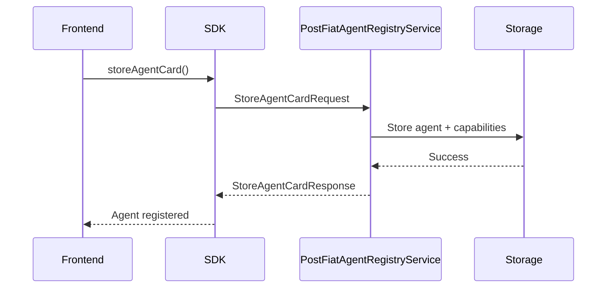
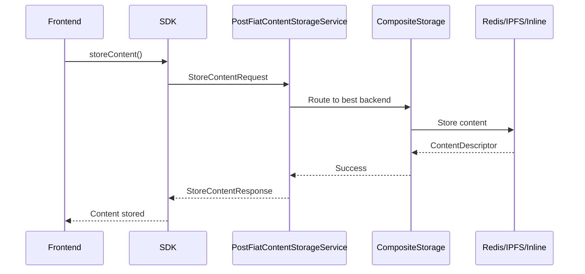
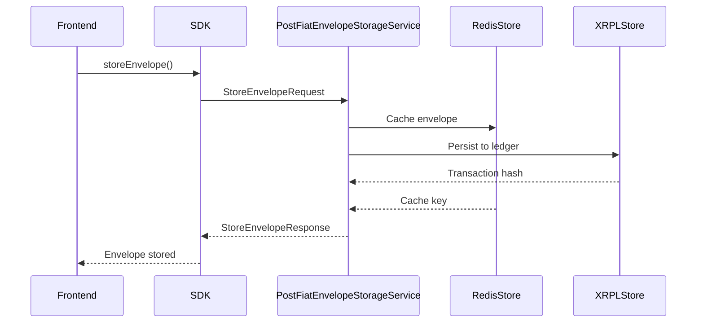

# API Services

The PostFiat SDK provides a comprehensive set of gRPC services that form the backbone of the agent-to-agent communication protocol. These services handle agent registration, content storage, and envelope management across multiple blockchain and storage backends.

## Service Architecture

The PostFiat SDK implements a **proto-first, multi-backend architecture** where:

- **gRPC services** provide the core business logic
- **HTTP REST APIs** are automatically generated from protobuf definitions  
- **Multiple storage backends** support different persistence strategies
- **Type-safe clients** are generated for Python, TypeScript, and Solidity

All services are defined in `proto/postfiat/v3/messages.proto` and implement comprehensive error handling, logging, and backend abstraction.

## Authentication

Services use **JWT-based authentication** with comprehensive error handling:
- Authentication errors: `2xxx` series (TOKEN_EXPIRED, INVALID_CREDENTIALS, etc.)
- Authorization errors: `3xxx` series (INSUFFICIENT_PERMISSIONS, ACCESS_DENIED, etc.) 
- Validation errors: `4xxx` series (SCHEMA_VALIDATION_FAILED, etc.)

See the [Error Handling documentation](generated/proto/index.md#error-codes) for complete error code reference.

---

## Agent Registry Service

**Purpose**: Manages agent discovery and registration with A2A protocol compliance and PostFiat-specific capabilities.

The Agent Registry Service enables agents to register their capabilities, discover other agents, and manage their identity within the PostFiat network. It extends the standard A2A protocol with PostFiat-specific features like envelope processing, ledger persistence, and context DAG traversal.

**Storage Backend**: Uses configurable content storage (typically `InlineStorage` for fast lookups)

**A2A Compliance**: Fully compatible with A2A v1 `AgentCard` specifications

### Service Matrix
<!-- AUTO-GENERATED SECTION: agent-registry-matrix -->

| RPC | Request Message | Response Message | Auth? | REST Path |
|-----|----------------|------------------|-------|-----------|
| GetAgentCard | PostFiatAgentRegistryServiceGetAgentCardRequest | PostFiatAgentRegistryServiceGetAgentCardResponse | 🔒 JWT | [GET /v3/agents/card](api/openapi.md#get-v3-agents-card) |
| StoreAgentCard | StoreAgentCardRequest | StoreAgentCardResponse | 🔒 JWT | [POST /v3/agents](api/openapi.md#post-v3-agents) |
| SearchAgents | SearchAgentsRequest | SearchAgentsResponse | 🔒 JWT | [GET /v3/agents/search](api/openapi.md#get-v3-agents-search) |
| DeleteAgentCard | DeleteAgentCardRequest | Empty | 🔒 JWT | [POST /v3/deleteagentcard](api/openapi.md#post-v3-deleteagentcard) |
| GetAgentByEnvelope | GetAgentByEnvelopeRequest | GetAgentByEnvelopeResponse | 🔒 JWT | [POST /v3/agents/by-envelope](api/openapi.md#post-v3-agents-by-envelope) |

<!-- END AUTO-GENERATED SECTION -->

### Agent Registry Flow



---

## Content Storage Service  

**Purpose**: Handles storage and retrieval of arbitrary content across multiple backend systems.

The Content Storage Service provides a unified interface for storing and retrieving content across different storage backends including Redis, IPFS, inline storage, and multipart storage for large files. It automatically selects the appropriate backend based on content size, type, and availability.

**Storage Backends**: 
- **InlineStorage**: Small content embedded directly
- **RedisStorage**: Fast access for frequently used content  
- **IPFSStorage**: Distributed storage for large files
- **MultipartStorage**: Chunked storage for oversized content
- **CompositeStorage**: Intelligent backend selection

### Service Matrix
<!-- AUTO-GENERATED SECTION: content-storage-matrix -->

| RPC | Request Message | Response Message | Auth? | REST Path |
|-----|----------------|------------------|-------|-----------|
| StoreContent | StoreContentRequest | StoreContentResponse | 🔒 JWT | [POST /v3/content](api/openapi.md#post-v3-content) |
| RetrieveContent | RetrieveContentRequest | RetrieveContentResponse | 🔒 JWT | [POST /v3/content/retrieve](api/openapi.md#post-v3-content-retrieve) |
| DeleteContent | DeleteContentRequest | Empty | 🔒 JWT | [POST /v3/deletecontent](api/openapi.md#post-v3-deletecontent) |
| CanHandleUri | CanHandleUriRequest | CanHandleUriResponse | – | [GET /v3/content/can-handle](api/openapi.md#get-v3-content-can-handle) |

<!-- END AUTO-GENERATED SECTION -->

### Content Storage Flow



---

## Envelope Storage Service

**Purpose**: Manages encrypted message envelopes across blockchain and traditional storage systems.

The Envelope Storage Service is the core of PostFiat's message persistence layer. It handles the storage and retrieval of encrypted message envelopes across multiple blockchain networks (XRPL, Ethereum) and traditional storage systems (Redis). The service supports advanced features like content hash indexing, context-based search, and sender-based message listing.

**Storage Backends**:
- **RedisEnvelopeStore**: High-performance caching and lookup
- **XRPLEnvelopeStore**: XRPL ledger persistence with memo storage  
- **EVMEnvelopeStore**: Ethereum/EVM-compatible chain storage

**Advanced Features**:
- Content hash-based deduplication
- Context DAG traversal support
- Sender-based message organization  
- Full-text search capabilities

### Service Matrix
<!-- AUTO-GENERATED SECTION: envelope-storage-matrix -->

| RPC | Request Message | Response Message | Auth? | REST Path |
|-----|----------------|------------------|-------|-----------|
| StoreEnvelope | StoreEnvelopeRequest | StoreEnvelopeResponse | 🔒 JWT | [POST /v3/envelopes](api/openapi.md#post-v3-envelopes) |
| RetrieveEnvelope | RetrieveEnvelopeRequest | RetrieveEnvelopeResponse | 🔒 JWT | [POST /v3/retrieveenvelope](api/openapi.md#post-v3-retrieveenvelope) |
| SearchEnvelopes | SearchEnvelopesRequest | SearchEnvelopesResponse | 🔒 JWT | [GET /v3/envelopes/search](api/openapi.md#get-v3-envelopes-search) |
| DeleteEnvelope | DeleteEnvelopeRequest | Empty | 🔒 JWT | [POST /v3/deleteenvelope](api/openapi.md#post-v3-deleteenvelope) |
| EnvelopeExists | EnvelopeExistsRequest | EnvelopeExistsResponse | 🔒 JWT | [POST /v3/envelopeexists](api/openapi.md#post-v3-envelopeexists) |
| FindEnvelopesByContentHash | FindEnvelopesByContentHashRequest | FindEnvelopesByContentHashResponse | 🔒 JWT | [POST /v3/findenvelopesbycontenthash](api/openapi.md#post-v3-findenvelopesbycontenthash) |
| FindEnvelopesByContext | FindEnvelopesByContextRequest | FindEnvelopesByContextResponse | 🔒 JWT | [POST /v3/findenvelopesbycontext](api/openapi.md#post-v3-findenvelopesbycontext) |
| ListEnvelopesBySender | ListEnvelopesBySenderRequest | ListEnvelopesBySenderResponse | 🔒 JWT | [POST /v3/listenvelopesbysender](api/openapi.md#post-v3-listenvelopesbysender) |

<!-- END AUTO-GENERATED SECTION -->

### Envelope Storage Flow



---

## Implementation Status

### Python SDK
✅ **Complete implementations** in `python/postfiat/services/impl/`:
- `AgentRegistryServiceImpl` - Full A2A compliance + PostFiat extensions
- `ContentStorageServiceImpl` - Multi-backend storage with intelligent routing  
- `EnvelopeStorageServiceImpl` - Async storage with Redis/XRPL/EVM support

### TypeScript SDK  
✅ **Complete implementations** in `typescript/src/services/impl/`:
- `AgentRegistryServiceImpl` - Connect-ES based gRPC-Web client
- `ContentStorageServiceImpl` - Browser-compatible storage backends
- `EnvelopeStorageServiceImpl` - Full-featured envelope management

### Generated Code
✅ **Auto-generated** from protobuf definitions:
- gRPC service stubs (Python: `*_pb2_grpc.py`, TypeScript: Connect-ES)
- Message types (Python: `*_pb2.py`, TypeScript: `*_pb.ts`) 
- OpenAPI REST specifications (`api/openapi_v2_generated.swagger.json`)

---

## SDK Integration Examples

### Python Client Example
```python
from postfiat.services import (
    AgentRegistryServiceImpl, 
    ContentStorageServiceImpl,
    EnvelopeStorageServiceImpl
)

# Initialize services
agent_service = AgentRegistryServiceImpl()
content_service = ContentStorageServiceImpl()
envelope_service = EnvelopeStorageServiceImpl()

# Store agent capabilities
response = agent_service.StoreAgentCard(request)
```

### TypeScript Client Example  
```typescript
import { 
  AgentRegistryServiceImpl,
  ContentStorageServiceImpl, 
  EnvelopeStorageServiceImpl 
} from '@postfiat/sdk';

// Initialize services
const agentService = new AgentRegistryServiceImpl();
const contentService = new ContentStorageServiceImpl();  
const envelopeService = new EnvelopeStorageServiceImpl();

// Store content
const response = await contentService.storeContent(request);
```

---

## Next Steps

- **[OpenAPI Documentation](api/openapi.md)** - Interactive REST API reference
- **[Python API Reference](python-api.md)** - Complete Python SDK documentation  
- **[Protocol Buffer Definitions](generated/proto/index.md)** - Message type specifications
- **[Architecture Overview](ARCHITECTURE.md)** - System design and data flow 